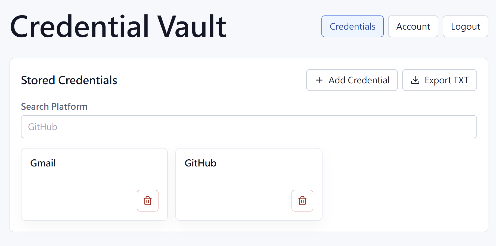

# Credential Vault

Credential Vault 是一個個人用的全端帳密保存專案，主要目標是練習 TypeScript、Vue.js、Bun、REST API、PostgreSQL、RWD、authentication、authorization，以及後端加密。

> 這是學習與展示用途的 demo project，請不要輸入真實常用帳號密碼。

## 專案截圖



## 功能

- 使用者註冊、登入、登出。
- 使用 cookie-based session 維持登入狀態。
- 新增、查看、修改、刪除個人 credential。
- 每筆 credential 只屬於建立它的使用者。
- 支援 platform 搜尋。
- 支援自訂加密欄位。
- 密碼與自訂欄位可切換顯示 / 隱藏。
- 支援複製 username、password、自訂欄位值。
- 支援匯出明文 TXT 備份。
- 支援桌面與手機版面。

## 技術棧

- Frontend: Vue 3, TypeScript, Vite, Vue Router
- Backend: Bun, TypeScript
- API: REST API, JSON
- Database: PostgreSQL
- ORM / migration: Drizzle ORM, Drizzle Kit
- Authentication: username/password, HTTP-only cookie session
- Password hashing: Argon2id via `Bun.password`
- Backend encryption: libsodium / NaCl authenticated encryption
- Deployment: Heroku

## 專案架構

```text
credential-vault/
├── apps/
│   ├── api/      # Bun backend API
│   └── web/      # Vue frontend
├── docs/
│   └── screenshots/
├── playground/   # learning exercises
├── PLAN.md
├── Procfile
└── package.json
```

這個 repo 採用前後端分離架構，但 API 和 Web 放在同一個 Git repository。部署時使用兩個 Heroku apps：

- API app: 跑 `apps/api`
- Web app: 跑 `apps/web`

Root `package.json` 透過 `HEROKU_APP_TYPE` 決定 Heroku 要 build/start 哪一個 app。

## 安全模型

Version 1 使用 trusted-backend security model。

這代表：

- Backend 在 request processing 過程中可能接觸 plaintext。
- Backend 持有解密資料庫中 credential 欄位的能力。
- Database 不應該儲存敏感 credential 欄位的 plaintext。
- 這不是 zero-knowledge encryption。
- 這不是 end-to-end encryption。

目前加密設計：

- Login password 使用 Argon2id hashing。
- Credential 的 username、password、notes 使用後端加密後存入資料庫。
- Custom fields 的 label 和 value 也以加密形式存入資料庫。
- Session cookie 存 raw random token。
- Database 只存 `sessionTokenHash`，不存 raw session token。

## 本機開發

### API

```bash
cd apps/api
bun install
cp .env.example .env
bun run crypto:generate-key
bun run db:migrate
bun run db:seed
bun run check-and-start
```

API 預設跑在：

```text
http://localhost:3000
```

### Web

```bash
cd apps/web
bun install
cp .env.example .env
bun run dev
```

Web 預設跑在：

```text
http://localhost:5173
```

## 測試

API 測試會使用獨立的 PostgreSQL test database。

```bash
cd apps/api
bun run test
```

## 部署注意事項

部署到 Heroku 時，需要設定環境變數。

API app:

```text
HEROKU_APP_TYPE=api
DATABASE_URL=<Heroku Postgres provided URL>
CREDENTIAL_ENCRYPTION_KEY=<generated encryption key>
CORS_ORIGIN=<deployed web origin>
NODE_ENV=production
```

Web app:

```text
HEROKU_APP_TYPE=web
VITE_API_BASE_URL=<deployed API origin>
```

部署時也需要確認：

- `.env` 沒有 commit 到 Git。
- API 使用 HTTPS 下的 secure cookie。
- CORS 只允許正式 Web origin。
- Vue Router 使用 `createWebHistory()` 時，Web server 有 fallback 到 `index.html`。
- 匯出的 TXT 是明文檔案，使用者需要自行妥善保存。

## 學習重點

這個專案不是一次把系統做完，而是透過小 milestone 逐步學習：

- TypeScript type / interface / function / module / async-await
- Bun server 與 request handling
- REST API 設計
- PostgreSQL schema、migration、query
- Vue component、props、emits、reactive state、computed、form binding、router
- Cookie session authentication
- Ownership-based authorization
- Backend encryption 與安全邊界
- RWD 與部署設定
